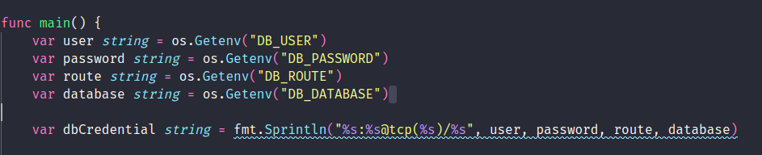
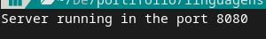

# [ENG]

# List of project developed in some course

## Base

- <a href="https://www.youtube.com/watch?v=jFfo23yIWac&t=453s&ab_channel=freeCodeCamp.org">freecodecamp video</a>
- <a href="https://www.youtube.com/watch?v=WQ-mg59x9PU&list=PLUbb2i4BuuzCX8CLeArvx663_0a_hSguW&index=2&ab_channel=NBKMundoTech"> NBK </a>
- <a href="https://www.amazon.com.br/Head-First-Go-Jay-Mcgavren/dp/1491969555/ref=sr_1_1?keywords=head+first+go&qid=1668109997&qu=eyJxc2MiOiIwLjAwIiwicXNhIjoiMC4wMCIsInFzcCI6IjAuMDAifQ%3D%3D&sr=8-1&ufe=app_do%3Aamzn1.fos.6121c6c4-c969-43ae-92f7-cc248fc6181d">Head First Go</a>

### Running in your computer.

First, we will need 3 program.

- <a href="https://go.dev/dl/">golang</a> The program used to run the code
- <a href="https://www.mysql.com/downloads/">mysql</a> The database
- <a href="https://www.mysql.com/downloads/">Git</a> To download the code

After the instalation, access the folder who will be installed the application

## How to open the terminal?

### Linux

- CRTL + ALT + T

### Windows

- CRTL + R, e pesquise CMD

use the comand `cd directory-name` to change the directory.

In the folder, paste `git clone https://github.com/AbraaoLeonardo/golang-project`.

## SERVIDOR

a miniserver with 3 pages

- main page
- form
- hello

## CRUD

A rest api who can (C)reate (R)ead (U)pdate (D)elete

## CRUD WITH GORILLA MUX

The rest crud, but with the help of gorilla/mux, a package to help the development

## Mysql

A rest api, who can make the crud(Create, Read, Update, Delete), in a database

Before running the project, you will needed to add your db credential

Now, past the follow command in your terminal

##### **linux**

Create the table, and insert some data
`go run db/database.go`
Run the server, and get the data from the database
`go run main.go` para rodar o programa.

##### **windows**

Create the table, and insert some data
`go run db/database.go`
Run the server, and get the data from the database
`go run main.go` para rodar o programa.

If the code run without no problem, you will see the message in your terminal

## BookStorage

Crud api, but with organization

### How to run?

In the folder, use the command `go run ./cmd/main/main.go`

# [PT-BR]

# Lista de projetos desenvolvidos durante o estudo da linguagem GO

## Conteudo utilizado como base

- <a href="https://www.youtube.com/watch?v=jFfo23yIWac&t=453s&ab_channel=freeCodeCamp.org">freecodecamp video</a>
- <a href="https://www.youtube.com/watch?v=WQ-mg59x9PU&list=PLUbb2i4BuuzCX8CLeArvx663_0a_hSguW&index=2&ab_channel=NBKMundoTech"> NBK </a>
- <a href="https://www.amazon.com.br/Head-First-Go-Jay-Mcgavren/dp/1491969555/ref=sr_1_1?keywords=head+first+go&qid=1668109997&qu=eyJxc2MiOiIwLjAwIiwicXNhIjoiMC4wMCIsInFzcCI6IjAuMDAifQ%3D%3D&sr=8-1&ufe=app_do%3Aamzn1.fos.6121c6c4-c969-43ae-92f7-cc248fc6181d">Head First Go</a>

### Como rodar no seu computador?

Precisaremos baixar 3 programas.

- <a href="https://go.dev/dl/">A linguagem GO</a>
- <a href="https://www.mysql.com/downloads/">O banco de dados mysql</a>
- <a href="https://www.mysql.com/downloads/">Git</a> para baixarmos o código fonte

Após a instalação dos 3 programas, acesse a pasta que você deseja instalar o programa pelo terminal

## Como abrir o terminal?

### Linux

- CRTL + ALT + T

### Windows

- CRTL + R, e pesquise CMD

navegue até a pasta utilizando o comando cd nome-da-pasta, até chegar no lugar que será baixado o código fonte no seu computador.

Para baixar, utilize o comando através do git `git clone https://github.com/AbraaoLeonardo/golang-project`.

## Servidor golang

Um server com 3 paginas

- main page
- form
- hello

## REST API

uma pequena API REST feita com golang

## CRUD com Gorilla mux

código refatorado utilizando o gorilla mux

## Mysql

CRUD REST API com mysql db

Dentro de db/database.go e do main.go, você precisará colocar as credenciais do seu banco de dados.

Para isso, utilize o seu editor de texto preferido. Notepad++, Visual Studio Code, Word, Vim, Nano

Após isso, cole os seguintes comandos no terminal.

##### **linux**

- `go run db/database.go` para criar as tabelas.
- `go run main.go` para rodar o programa.

##### **windows**

- `go run db\database.go` para criar as tabelas.
- `go run main.go` para rodar o programa.

No terminal, receberemos a mensagem de sucesso

## BookStorage

Crud api, porem, organizado por pastas e arquivos

### Como rodar a aplicação?

Na pasta, Utilize o comando `go run ./cmd/main/main.go`
